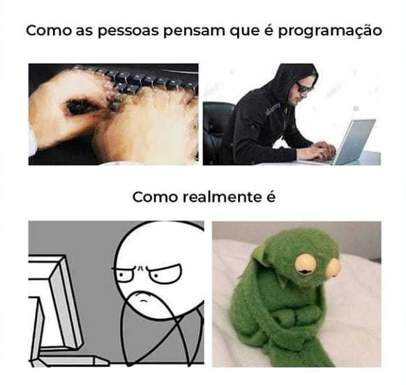

# 💫 Sobre mim | Sobre mí

### 🇧🇷 Português  
Sou um desenvolvedor independente, focado em desenvolvimento web, scripts e segurança da informação.  
Atualmente estudando C e sistemas baseados em Linux.  
Tenho interesse em automação, back-end e projetos educacionais ou open-source.

### 🇪🇸 Español  
Soy un desarrollador independiente centrado en desarrollo web, scripting y ciberseguridad.  
Actualmente estoy aprendiendo C y trabajando con sistemas basados en Linux.  
Me interesan la automatización, el backend y los proyectos educativos o de código abierto.

---

## 🌐 Redes sociais | Redes sociales
 
 
 

---

## 💻 Tech Stack

<b>▶️ Clique para ver minhas tecnologias</b>
 

### 👨‍💻 Languages

### 🧰 Tools & Frameworks

### 🖥️ OS & Infra

### 🎨 Design & Edição

---

## 📊 GitHub Stats

  
  

---

## 🏆 Trophies

---

## ✍️ Dev Quote

---

### 😂 Meme

---
